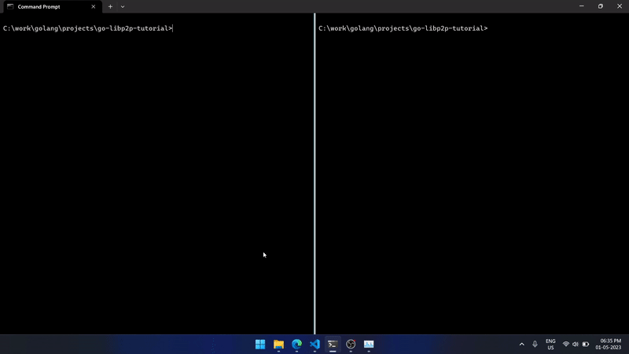

## Getting started guide for `go-libp2p` node

---

This repo contains source code example for running a simple node with [libp2p](https://libp2p.io/)'s [Go](https://go.dev/) implementation called [go-libp2p](https://github.com/libp2p/go-libp2p). The node can send and receive "ping" messages depending on how it started the execution.

### Required commands:

1. Build module:

    Unix/Linux: `go build -o <OUTPUT_BINARY_NAME>`

    or

    Windows: `go build -o <OUTPUT_BINARY_NAME>.exe`

2. Run listening node in one terminal:

    Unix/Linux: `./OUTPUT_BINARY_NAME`

    or

    Windows: `OUTPUT_BINARY_NAME.exe`

3. Ping listening node from another terminal using [multiaddress](https://docs.libp2p.io/concepts/fundamentals/addressing/) as command line argument:

    Unix/Linux: `./OUTPUT_BINARY_NAME multiaddress`

    or

    Windows: `OUTPUT_BINARY_NAME.exe multiaddress`

### Demo of build & execution:

---

Official reference guide: [Run a go-libp2p node](https://docs.libp2p.io/guides/getting-started/go/)
